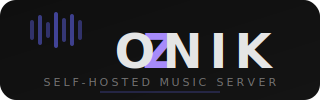

<p align="center">
  
</p>

<p align="center">
  Self-hosted music backend with OpenSubsonic API.<br>
  Track-focused library management with smart discovery, Soulseek downloads, audio analysis, and vibe-based recommendations.
</p>

<p align="center">
  Built to serve <a href="https://symfonium.app/">Symfonium</a> on Android via the OpenSubsonic protocol.
</p>

## Features

- **OpenSubsonic API** - Full Subsonic/OpenSubsonic implementation for Symfonium compatibility
- **Track-focused** - Download individual tracks, not full discographies
- **Soulseek downloads** - Native P2P client with multi-strategy search and quality scoring
- **Last.fm integration** - Discovery, scrobbling, loved track sync
- **Audio analysis** - BPM, key, energy, danceability via Essentia
- **Vibe embeddings** - CLAP-based 512-dim audio embeddings for similarity search
- **Echo Match** - Find tracks with similar vibes
- **Smart discovery** - Expand library from favorites using Last.fm similar tracks/artists
- **Stream transcoding** - On-the-fly ffmpeg transcoding (FLAC to MP3/OGG/Opus)
- **Scheduled tasks** - Automated library scan, enrichment, discovery, playlist generation
- **Modern web UI** - SvelteKit + Tailwind CSS dark theme

## Architecture

```
FastAPI (backend) ─── SQLite (WAL) ─── ARQ + Redis (workers)
     │                                       │
SvelteKit (frontend)                   Background tasks:
     │                                  - Downloads
OpenSubsonic API ──── Symfonium        - Analysis
     │                                  - Enrichment
     ├── slskd (Soulseek)              - Discovery
     ├── Last.fm API                   - Scheduler
     └── MusicBrainz
```

## Quick Start

### Development

```bash
# Backend
uv venv && uv pip install -e .
cp zonik.toml.example zonik.toml  # Edit with your settings
uv run uvicorn backend.main:app --reload --port 8000

# Frontend
cd frontend && npm install && npm run dev

# Worker (requires Redis)
uv run arq backend.workers.WorkerSettings
```

### Production (Proxmox LXC)

```bash
# Run on your Proxmox host — creates the CT, installs everything, starts services:
bash <(curl -sL https://raw.githubusercontent.com/Pr0zak/Zonik/main/create-ct.sh)
```

See [Installation Guide](docs/installation.md) for details.

## Configuration

Edit `zonik.toml` (or `/etc/zonik/zonik.toml` in production):

```toml
[library]
music_dir = "/music"

[soulseek]
slskd_url = "http://your-slskd-host:5030"
slskd_api_key = "your-key"

[lastfm]
api_key = "your-key"
write_api_key = "your-key"
write_api_secret = "your-secret"
```

See [Configuration Reference](docs/configuration.md) for all options.

## Subsonic API

Point Symfonium at `http://<host>:3000/rest` with credentials `admin` / `admin`.

Supported endpoints: ping, getLicense, getArtists, getArtist, getAlbum, getSong, getAlbumList2, search3, stream, download, getCoverArt, star, unstar, scrobble, getPlaylists, createPlaylist, getBookmarks, savePlayQueue, and more.

See [API Reference](docs/api.md) for the full list.

## Tech Stack

| Component | Technology |
|-----------|------------|
| Backend | FastAPI + Uvicorn |
| Database | SQLite (WAL) + FTS5 |
| ORM | SQLAlchemy 2.0 async |
| Task Queue | ARQ + Redis |
| Frontend | SvelteKit 5 + Tailwind CSS |
| Audio Tags | mutagen |
| Audio Analysis | Essentia |
| Vibe Embeddings | CLAP |
| Metadata | MusicBrainz + Last.fm |
| Downloads | Native Soulseek P2P client |

## License

MIT
