<p align="center">
  
</p>

<p align="center">
  Self-hosted music backend with OpenSubsonic API.<br>
  Track-focused library management with smart discovery, Soulseek downloads, audio analysis, and AI-powered recommendations.
</p>

<p align="center">
  Includes a native Android app — phone, Android Auto, Google TV and a Pixel Watch companion — under <a href="mobile/"><code>mobile/</code></a>.
</p>

## Screenshots

### Web

<p align="center">
  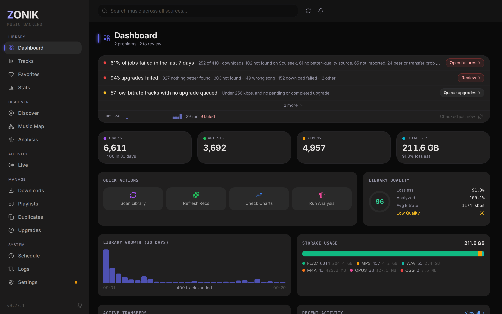
  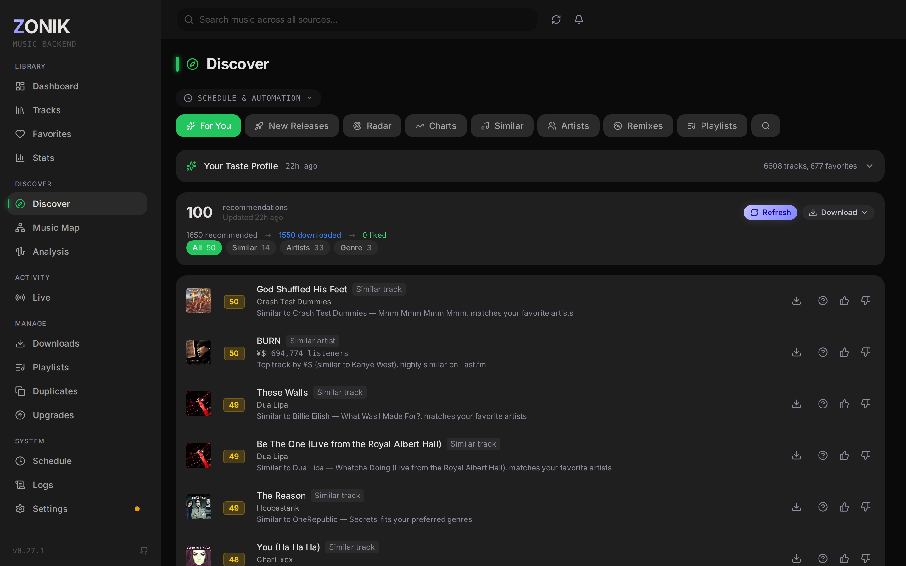
</p>
<p align="center">
  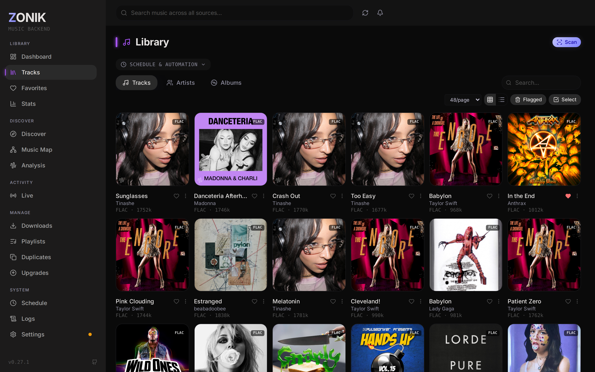
  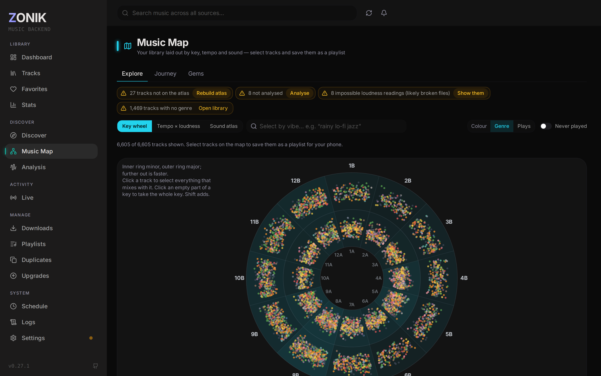
</p>
<p align="center">
  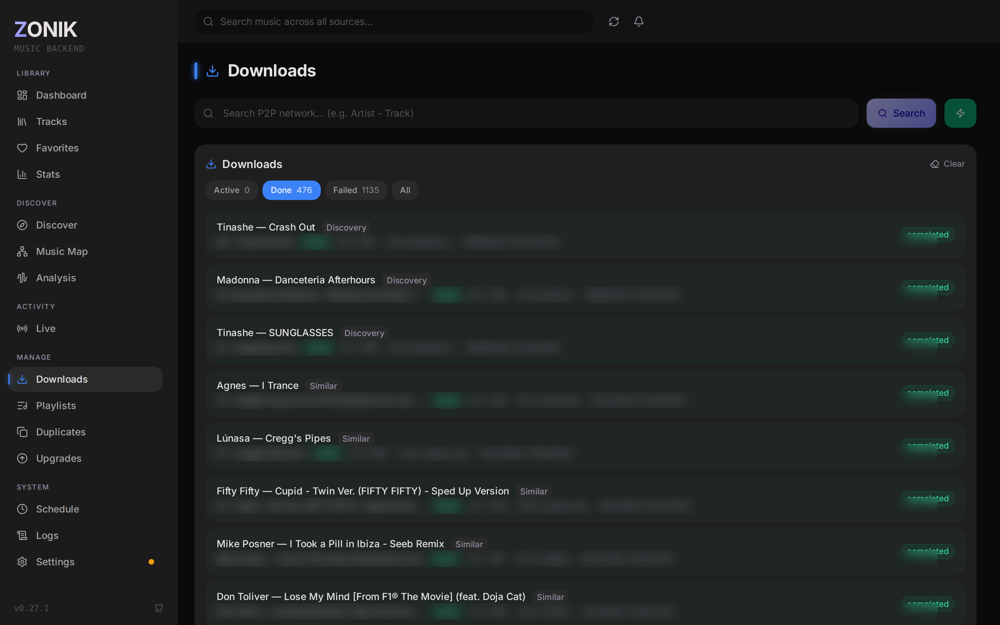
  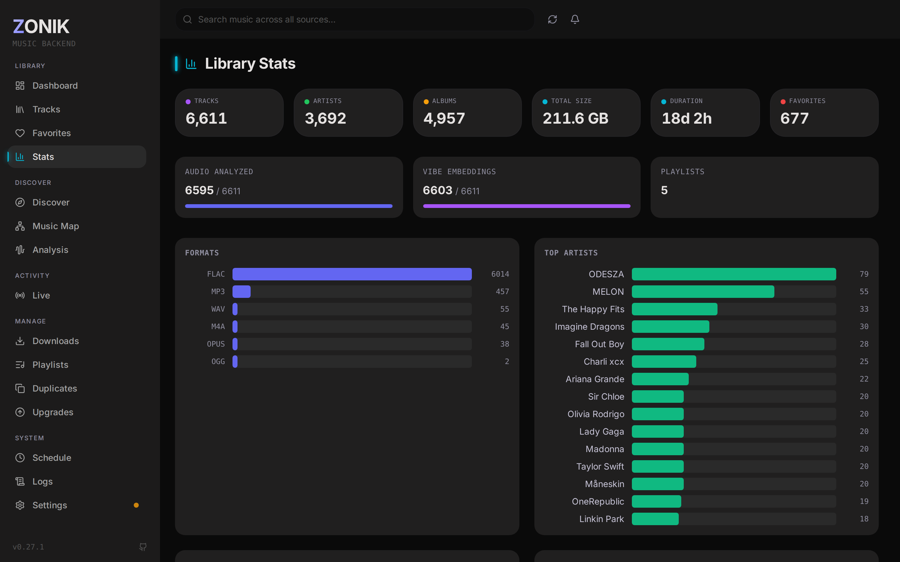
</p>

### Android

<p align="center">
  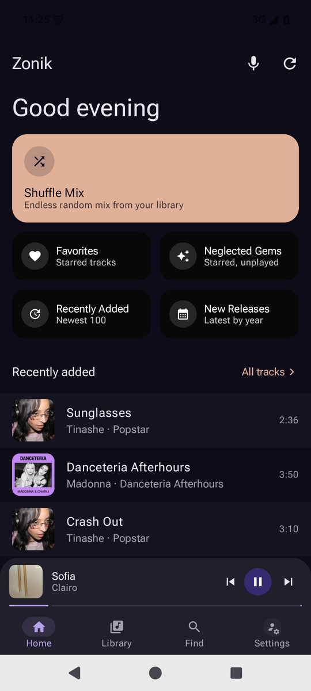
  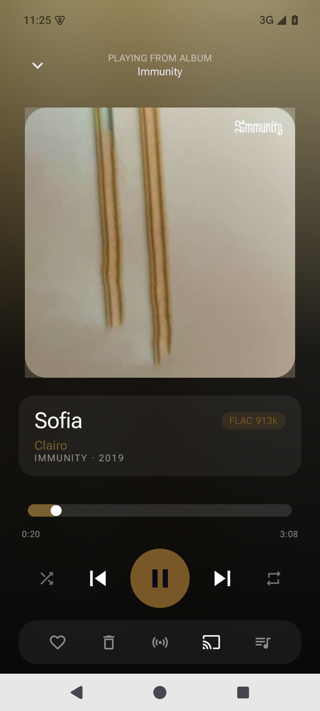
  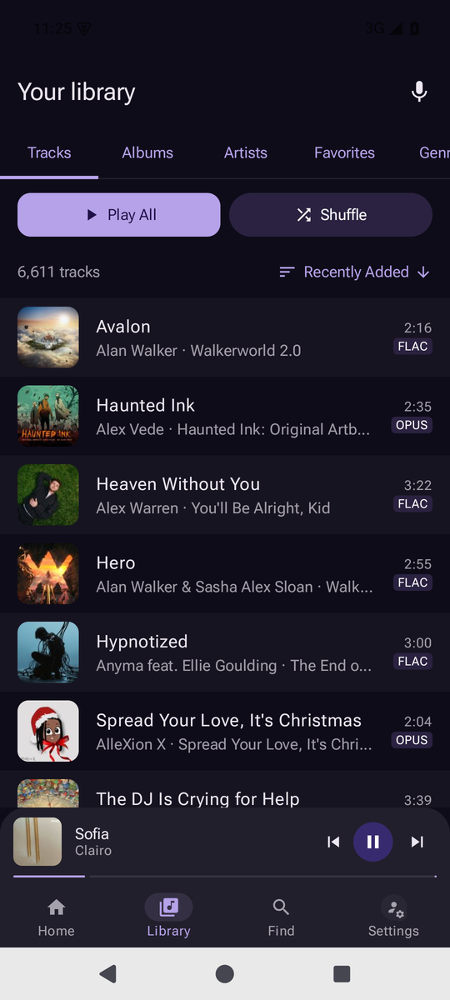
  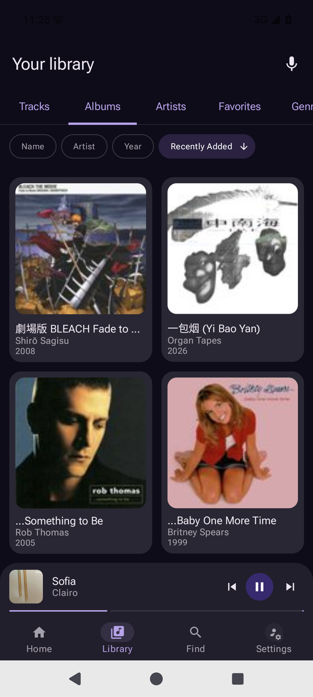
</p>

### Google TV

Now Playing is the whole screen. UP opens the actions strip, DOWN slides the browse rails up while the music keeps playing.

<p align="center">
  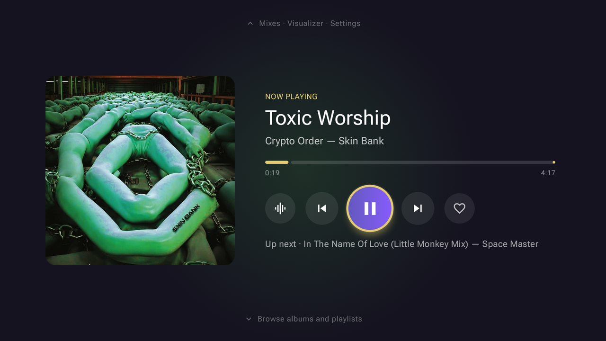
  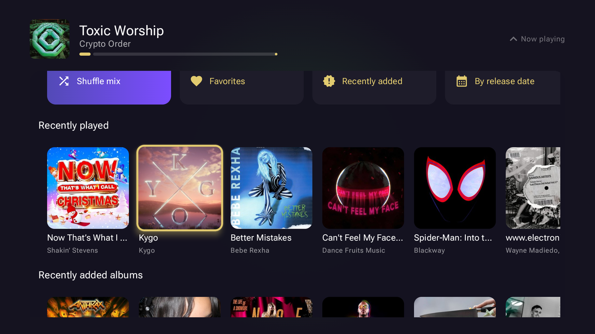
</p>
<p align="center">
  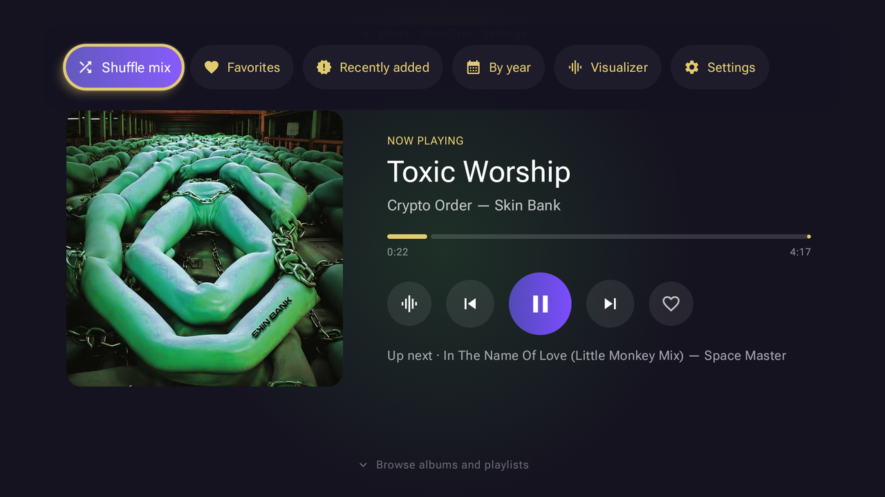
  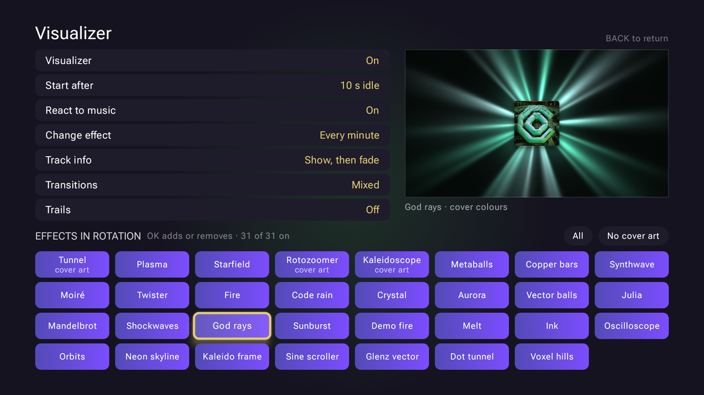
</p>

Left idle, the TV turns into a demo-scene visualizer: 93 GPU shader effects that move to the music (bass, mids, highs, kicks and a 64-band spectrum) — tunnels and flights, endless zooms and fractals, spectrum meters, beat-driven patterns and classic demo effects — switching on the beat through 20 wipes. Colours come from the album art, or random, cycling, or mixed per effect.

<p align="center">
  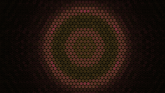
  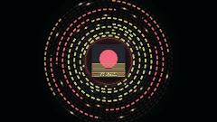
  
  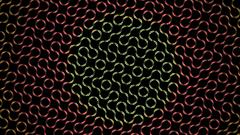
</p>
<p align="center">
  
  
  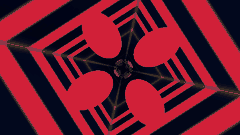
  
</p>
<p align="center">
  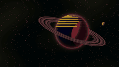
  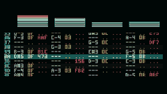
  
  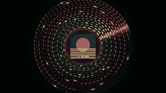
</p>

All 93, animated: [docs/tv-visualizer.md](docs/tv-visualizer.md).

## Features

- **OpenSubsonic API** - Full Subsonic/OpenSubsonic implementation for the included mobile app and any Subsonic client
- **Track-focused** - Download individual tracks, not full discographies
- **Native Soulseek client** - Built-in P2P client with multi-strategy search and quality scoring
- **Last.fm integration** - Discovery, scrobbling, loved track sync, similar artists/tracks
- **Audio analysis** - BPM, key, energy, danceability via Essentia
- **Vibe embeddings** - CLAP-based 512-dim audio embeddings for similarity search
- **AI recommendations** - Claude-powered taste profiling, playlist curation, and track suggestions
- **Playlist discovery** - Find and import playlists from Spotify/Deezer, preview tracks, download missing
- **Echo Match** - Find tracks with similar vibes using audio embeddings
- **Remix discovery** - Find remixes, edits, and versions of library tracks via Last.fm
- **Track upgrades** - Automatically find and replace low-quality tracks with better versions
- **Stream transcoding** - On-the-fly ffmpeg transcoding (FLAC to MP3/OGG/Opus)
- **Music Map** - Your library laid out by key, tempo and sound; explore, plot a journey, find neglected gems, save any selection as a playlist
- **Duplicates** - Find duplicate files across formats and reclaim the space
- **Live view** - Real-time now-playing and history across every connected client
- **Scheduled tasks** - Automated library scan, enrichment, discovery, playlist generation
- **Modern web UI** - SvelteKit 5 + Tailwind CSS dark theme, 18 pages, built as an admin console for the library
- **Native clients** - Android phone (with Android Auto and Chromecast), a Google TV app with a demo-scene music visualizer, and a standalone Pixel Watch player

## Architecture

```
FastAPI (backend) ─── SQLite (WAL+FTS5) ─── ARQ + Redis (workers)
     │                                             │
SvelteKit (frontend)                         Background tasks:
     │                                        - Soulseek downloads
OpenSubsonic API ──┬── mobile/app (Android phone, Auto, TV)
     │             ├── mobile/wear (Pixel Watch — standalone)
     │             └── any Subsonic client      - Audio analysis (Essentia)
     ├── Native Soulseek P2P                    - Vibe embeddings (CLAP)
     ├── Last.fm API                            - AI recommendations
     ├── Spotify / Deezer APIs                  - Discovery & enrichment
     └── Claude API (AI features)               - Scheduled jobs
```

## Quick Start

### Development

```bash
# Backend
uv venv && uv pip install -e .
cp zonik.toml.example zonik.toml  # Edit with your settings
uv run uvicorn backend.main:app --reload --port 8000

# Frontend
cd frontend && npm install && npm run dev

# Worker (requires Redis)
uv run arq backend.workers.WorkerSettings
```

### Production (Proxmox LXC)

```bash
# Run on your Proxmox host — creates the CT, installs everything, starts services:
bash <(curl -sL https://raw.githubusercontent.com/Pr0zak/Zonik/main/create-ct.sh)
```

See [Installation Guide](docs/installation.md) for details.

## Configuration

Edit `zonik.toml` (or `/etc/zonik/zonik.toml` in production):

```toml
[library]
music_dir = "/music"

[soulseek]
username = "your-username"
password = "your-password"

[lastfm]
api_key = "your-key"
write_api_key = "your-key"
write_api_secret = "your-secret"
```

See [Configuration Reference](docs/configuration.md) for all options.

## Subsonic API

Point the bundled mobile app (or any Subsonic client) at `http://<host>:3000/rest` with credentials `admin` / `admin`.

Supported endpoints: ping, getLicense, getArtists, getArtist, getAlbum, getSong, getAlbumList2, search3, stream, download, getCoverArt, star, unstar, scrobble, getPlaylists, createPlaylist, getBookmarks, savePlayQueue, and more.

See [API Reference](docs/api.md) for the full list.

## Mobile (Android phone, Google TV + Pixel Watch)

The `mobile/` subdirectory is a Gradle multi-module Kotlin/Compose project:

- **`mobile/app/`** — phone app with Android Auto + Google TV + Chromecast support. On a TV it switches to a remote-first UI (the Stage: Now Playing as the root, an UP actions strip, DOWN browse rails) and an idle visualizer of 93 OpenGL ES 2 demo-scene effects — tunnels and flights, endless zooms and fractals, spectrum meters, beat-driven patterns and more ([see them all](docs/tv-visualizer.md)) — rendered at 960×540 and driven by the live FFT, the waveform and the server's per-track BPM. Tuned for the Chromecast with Google TV's Mali-G31.
- **`mobile/wear/`** — Pixel Watch standalone player (browses + streams direct from server)
- **`mobile/core/`** — shared Subsonic API, models, and auth interceptor used by both

### Android Auto

The phone app works in the car through **Android Auto**: plug in or connect wirelessly and Zonik appears in Auto's media apps.

- Browse Mix, Recently Added, Library and Playlists — the tabs are yours to reorder in the phone's settings
- Voice search ("play … on Zonik") and typed search, which lists results rather than guessing
- Star or delete the playing track from the car screen
- Songs you don't have yet can be fetched straight from Auto's search, over Soulseek via the server

Because the APK is sideloaded rather than installed from the Play Store, Android Auto hides it until you allow unknown sources: open Android Auto's settings, tap **Version** ten times to enable developer mode, then turn on **Unknown sources** in the developer settings.

### Installing

Latest builds are attached to GitHub releases tagged **`app-vX.Y.Z`** — grab `zonik-vX.Y.Z-debug.apk` (phone) or `zonik-wear-vX.Y.Z-debug.apk` (watch). The phone app's pairing flow generates a 6-digit code that the server's `/pair` page consumes — no typing credentials on the watch. The phone can also push its `ServerConfig` to a paired watch over Bluetooth via the Wear Data Layer (**Settings → Wear OS → Send**).

### Building

```bash
cd mobile
export JAVA_HOME=$HOME/tools/jdk-17.0.12
export ANDROID_HOME=$HOME/tools/android-sdk
./gradlew assembleDebug
```

CI builds + publishes APKs automatically on every `app-v*` tag (`.github/workflows/mobile-release.yml`).

See [mobile/README.md](mobile/README.md) for the full mobile docs — features, screenshots, install flows for phone / TV / watch, and tech stack.

## Tech Stack

| Component | Technology |
|-----------|------------|
| Backend | FastAPI + Uvicorn |
| Database | SQLite (WAL) + FTS5 |
| ORM | SQLAlchemy 2.0 async |
| Task Queue | ARQ + Redis |
| Frontend | SvelteKit 5 + Tailwind CSS |
| Audio Tags | mutagen |
| Audio Analysis | Essentia |
| Vibe Embeddings | CLAP |
| AI | Claude API |
| Metadata | Last.fm + Spotify + Deezer |
| Downloads | Native Soulseek P2P client |
| Mobile (phone, TV + watch) | Kotlin · Jetpack Compose · Wear Compose Material 3 · Media3 ExoPlayer · Retrofit · Hilt |
| TV visualizer | OpenGL ES 2.0 fragment shaders · Android `Visualizer` FFT + waveform |

## License

MIT
