# Google TV visualizer

Left idle (or opened from the actions strip), the Google TV app becomes a demo-scene music visualizer: 93 OpenGL ES 2 fragment-shader effects driven by the live FFT, the waveform, a 64-band spectrum and the server's per-track BPM. Each clip below is the real shader running against a simulated 120 bpm beat, with a stand-in cover.

Settings → Visualizer picks which effects rotate, how often they change, the transition (20 wipes, or Mixed) and its speed, where the colours come from (album art, random, cycling, or mixed per effect), and whether track info sits in the centre or a corner.

## Patterns and their variations

<table>
<tr><td align="center"> Hex pulse</td><td align="center">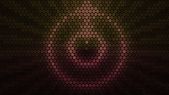 Hex radar</td><td align="center">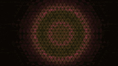 Triangle pulse</td></tr>
<tr><td align="center">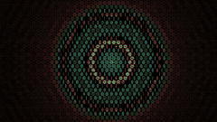 Hex flip</td><td align="center">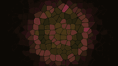 Cell pulse</td><td align="center"> Spectrum rings</td></tr>
<tr><td align="center">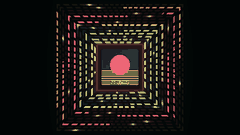 Square meter</td><td align="center">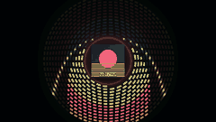 Spiral meter</td><td align="center"> Radar</td></tr>
<tr><td align="center"> Apollonian</td><td align="center">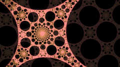 Neon circles</td><td align="center">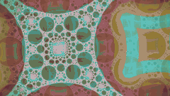 Circle pulse</td></tr>
<tr><td align="center">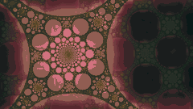 Glass circles</td><td align="center"> Truchet maze</td><td align="center">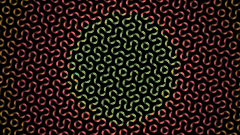 Hex Truchet</td></tr>
<tr><td align="center">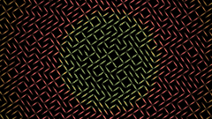 Maze</td><td align="center">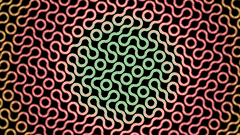 Truchet tubes</td></tr>
</table>

## Trippy and beat-driven

<table>
<tr><td align="center"> Hypno spiral</td><td align="center">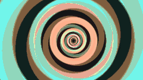 Hypno rings</td><td align="center"> Kaleido fractal</td></tr>
<tr><td align="center">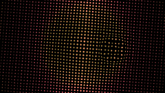 Bass lens</td><td align="center">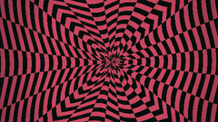 Op art</td><td align="center">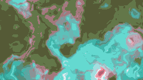 Liquid marble</td></tr>
<tr><td align="center">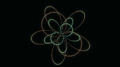 Rose curves</td><td align="center">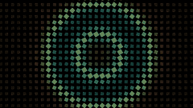 Pulse grid</td><td align="center">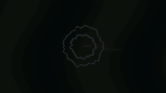 Lightning</td></tr>
<tr><td align="center">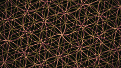 Flower of life</td><td align="center">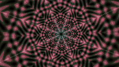 Strobe kaleido</td><td align="center">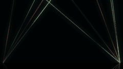 Laser show</td></tr>
</table>

## Tunnels and flight

<table>
<tr><td align="center">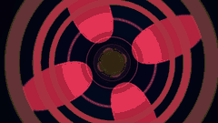 Tunnel</td><td align="center">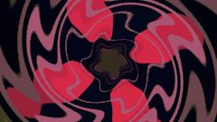 Warp tunnel</td><td align="center"> Wormhole</td></tr>
<tr><td align="center">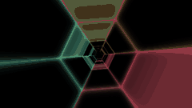 Hex tunnel</td><td align="center"> Square tunnel</td><td align="center">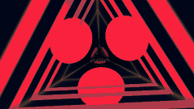 Triangle tunnel</td></tr>
<tr><td align="center">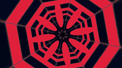 Octagon tunnel</td><td align="center"> Bent tube</td><td align="center">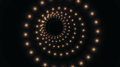 Dot tunnel</td></tr>
<tr><td align="center">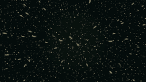 Starfield</td><td align="center">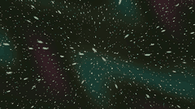 Nebula stars</td><td align="center">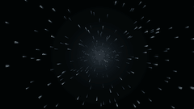 Hyperspace</td></tr>
<tr><td align="center">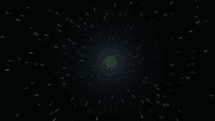 Rainbow warp</td><td align="center">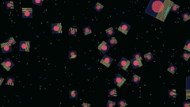 Flying covers</td><td align="center">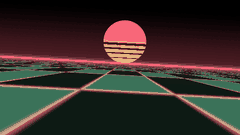 Synthwave</td></tr>
<tr><td align="center">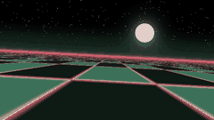 Night drive</td><td align="center">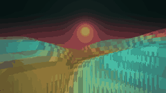 Voxel hills</td><td align="center">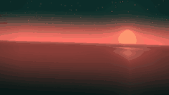 Ocean flyover</td></tr>
<tr><td align="center">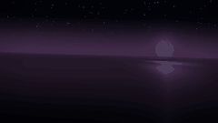 Moonlit ocean</td><td align="center">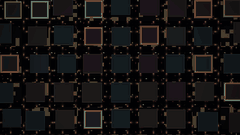 City at night</td><td align="center">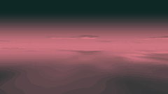 Cloud flight</td></tr>
<tr><td align="center"> Planet flyby</td><td align="center">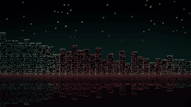 Neon skyline</td><td align="center">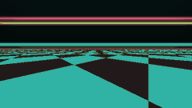 Checkerboard</td></tr>
</table>

## Zooms and fractals

<table>
<tr><td align="center">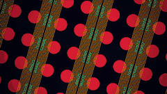 Rotozoomer</td><td align="center">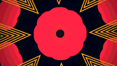 Kaleidoscope</td><td align="center">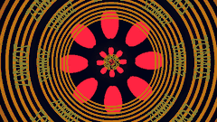 Kaleido zoom</td></tr>
<tr><td align="center">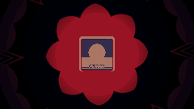 Kaleido frame</td><td align="center">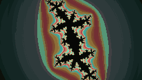 Julia</td><td align="center">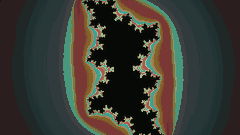 Julia pulse</td></tr>
<tr><td align="center">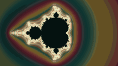 Mandelbrot</td><td align="center">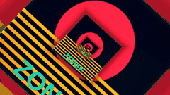 Droste zoom</td><td align="center"> Droste spiral</td></tr>
<tr><td align="center"> Cover mosaic</td><td align="center"> Kaliset</td><td align="center"> Tile zoom</td></tr>
<tr><td align="center"> Deformations</td></tr>
</table>

## Spectrum and scopes

<table>
<tr><td align="center"> Sunburst</td><td align="center"> Oscilloscope</td><td align="center"> LED bars</td></tr>
<tr><td align="center"> Waterfall</td><td align="center"> Lissajous</td><td align="center"> Shockwaves</td></tr>
<tr><td align="center"> Tracker</td></tr>
</table>

## Classic demo

<table>
<tr><td align="center"> Plasma</td><td align="center"> Acid plasma</td><td align="center"> Soft plasma</td></tr>
<tr><td align="center"> Metaballs</td><td align="center"> Copper bars</td><td align="center"> Moiré</td></tr>
<tr><td align="center"> Fire</td><td align="center"> Crystal</td><td align="center"> Aurora</td></tr>
<tr><td align="center"> Shadebobs</td><td align="center"> Orbits</td></tr>
</table>

## Cover treatments and feedback

<table>
<tr><td align="center"> God rays</td><td align="center"> Melt</td><td align="center"> Ink</td></tr>
<tr><td align="center"> Water ripples</td><td align="center"> VHS glitch</td><td align="center"> Bump-mapped</td></tr>
<tr><td align="center"> Halftone</td><td align="center"> ASCII</td><td align="center"> Milkdrop warp</td></tr>
</table>
