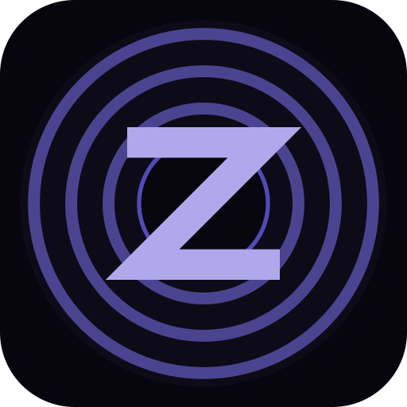

<p align="center">
  
</p>

<h1 align="center">Zonik Mobile</h1>

<p align="center">
  Native Android phone, Google TV, and Pixel Watch clients for
  <a href="https://github.com/Pr0zak/Zonik">Zonik</a> self-hosted music servers.<br>
  Streams over OpenSubsonic with Android Auto and Chromecast on the phone,
  and a fully standalone player on the watch.
</p>

> This directory is part of the [Zonik](https://github.com/Pr0zak/Zonik)
> monorepo. The standalone `Pr0zak/Zonik-mobile` repo has been archived;
> new releases live under the parent repo and are tagged `app-vX.Y.Z`.

## Modules

```
mobile/
├── app/   — phone app (Android Auto, Chromecast, Google TV)
├── wear/  — Pixel Watch standalone player
└── core/  — shared Subsonic API, models, auth interceptor
```

## Features

### Playback (phone)
- **Streaming** with smart bitrate (Wi-Fi/cellular), adaptive degradation on slow connections
- **5-band equalizer** with 10 presets, custom band levels, and system EQ launch
- **Waveform seek bar** — static track waveform from server API, cached locally
- **Connection resilience** — automatic retry with exponential backoff, network reconnect recovery
- **Queue restore** — resumes last queue and position after app restart

### Multi-Device
- **Android Auto** — configurable browse tabs, star/delete buttons, voice search
- **Chromecast** — Google Cast SDK with styled media receiver
- **Google TV** — dedicated TV interface with D-pad navigation, visual screensaver
- **Pixel Watch** — standalone player; streams direct from server, no phone required

### Google TV
- Left sidebar navigation (Home / Settings)
- Shuffle Mix + Shuffle Favorites — one-tap playback
- Now Playing card with ambient color glow from album art, playback controls, star, progress bar
- Visual screensaver (10s idle) — large album art with breathing animation, floating particles, pulsing glow rings on bass, aurora color bands
- Beat detection via Visualizer API
- Pairing code login — type server URL, get 6-digit code, enter on server `/pair` page
- Install via Downloader — enter `zonik:3000/app`
- Self-update — Check Update downloads + installs APK directly

### Pixel Watch
- **Standalone** — own ExoPlayer + 200 MB streaming cache, talks Subsonic directly. No phone needed at runtime.
- **Pair via phone over Bluetooth** — open the phone app, **Settings → Wear OS → Send**. The phone pushes its `ServerConfig` (URL + username + API key) to the watch via the Wear Data Layer. Zero URL typing on a tiny screen.
- **Manual pairing fallback** — the watch's pairing screen has a "or enter URL manually" link that takes you through a 6-digit `/pair` flow if the phone push isn't available.
- **Quick Mix** — primary action on the no-track screen. One tap → 50 random songs from the server.
- **Scrobbling** — watch plays show up in the server's `/api/live` view, distinguished from phone plays by `c=ZonikWear`.
- **Material 3** UI tuned for round watch faces: `ScreenScaffold` chrome, `FilledTonalButton` lists, transport row with 48 / 64 dp touch targets, vertical scroll so secondary actions are reachable.

### Library & Offline
- **Library sync** via OpenSubsonic `search3` API with starred + flagged sync
- **Offline caching** — auto-cache queue and favorites, separate pinned storage (never evicted)
- **Mark for deletion** — synced with server, bulk delete from Flagged tab
- **8 Library tabs** — Tracks, Albums, Artists, Favorites, Genres, Playlists, Flagged, Offline

### UI
- Premium dark theme — glass morphism, gradient buttons, gold lossless badges, floating mini player
- Now Playing — album art glow, glass controls, Palette colors, queue with zebra-stripe, swipe-to-dismiss
- Stats page — format/bitrate/genre/decade distributions, most played, top artists
- Editable server settings — tap to edit URL, username, API key with test connection

### Other
- Scrobbling via Subsonic API (phone, TV, watch)
- Self-update from GitHub releases
- Debug logging with upload to the Zonik server's `/api/logs`

## Screenshots

*Coming soon*

## Requirements

- Android 8.0+ (API 26)
- A running [Zonik](https://github.com/Pr0zak/Zonik) server reachable from the device

## Install

Builds are attached to GitHub releases on the parent repo, tagged
**`app-vX.Y.Z`**: https://github.com/Pr0zak/Zonik/releases

### Phone

Download `zonik-vX.Y.Z-debug.apk` from the latest release and sideload.

For **Android Auto**: enable Developer Mode (tap version 10× in Android
Auto settings), then enable "Unknown sources" in developer settings.

### Google TV

1. Install the **Downloader** app from Play Store
2. Open Downloader, enter: `zonik:3000/app`
3. Install the APK
4. Open Zonik → enter server URL → tap **"Pair with code"**
5. Go to `zonik:3000/pair` on your phone and enter the 6-digit code

### Pixel Watch

The fastest path is to use the phone app's "pair watch" action so you
never have to type a URL on the watch.

1. Install the **phone app** (above) and pair it with your Zonik server
2. Download `zonik-wear-vX.Y.Z-debug.apk` from the latest release
3. On the watch, enable developer options: **Settings → System → About →
   tap Build number 7 times**, then turn on **ADB debugging** and
   **Wireless debugging**
4. Tap **Wireless debugging → Pair new device** — note the IP + pair port
   and 6-digit code
5. From a computer on the same Wi-Fi:
   ```bash
   adb pair <ip>:<pair-port>          # enter the 6-digit code
   adb connect <ip>:<connect-port>    # the port shown on the Wireless debugging screen
   adb -s <ip>:<connect-port> install zonik-wear-vX.Y.Z-debug.apk
   ```
6. Open **Zonik** on the watch — it shows the pairing screen.
7. On the phone, open Zonik → **Settings → Wear OS → Send**. The watch
   auto-navigates to Now Playing once the config arrives.
8. Tap **Quick Mix** to start streaming.

Future updates install over the top with `adb install -r ...` — same signing
identity across CI builds.

## Build

The gradle root is `mobile/`. Always `cd mobile` first.

```bash
cd mobile
export JAVA_HOME=$HOME/tools/jdk-17.0.12
export PATH="$JAVA_HOME/bin:$PATH"
export ANDROID_HOME=$HOME/tools/android-sdk

./gradlew :app:assembleDebug     # phone APK
./gradlew :wear:assembleDebug    # watch APK
./gradlew assembleDebug          # both
```

APK outputs:
- Phone: `mobile/app/build/outputs/apk/debug/app-debug.apk`
- Wear:  `mobile/wear/build/outputs/apk/debug/wear-debug.apk`

Local builds use `~/.android/debug.keystore`; CI builds use the
`DEBUG_KEYSTORE_BASE64` repo secret restored into `mobile/ci-debug.keystore`.
Locally-built APKs and CI-built APKs have different signing identities — to
install one over the other, uninstall first.

## Release flow

```bash
# from repo root
git tag app-vX.Y.Z
git push origin app-vX.Y.Z
```

The `.github/workflows/mobile-release.yml` workflow at the repo root picks
up the tag, builds both APKs in `mobile/`, and attaches them to the
matching GitHub release (created automatically). Backend tags follow a
separate `server-vX.Y.Z` scheme and don't touch this workflow.

## Tech Stack

- Kotlin, Jetpack Compose for the phone, **Wear Compose Material 3** for the watch
- AndroidX Media3 (ExoPlayer) + `MediaLibraryService` on both phone and watch
- `SimpleCache` + `CacheDataSource` for audio caching
- Retrofit + OkHttp + kotlinx.serialization
- Room + Paging 3 (phone)
- Hilt (phone DI); manual DI (watch — keeps the wear module small)
- Coil for images
- Google Cast SDK + AndroidX MediaRouter
- Wear Data Layer (`play-services-wearable`) for cross-device pairing

## License

Private — for personal use only.
